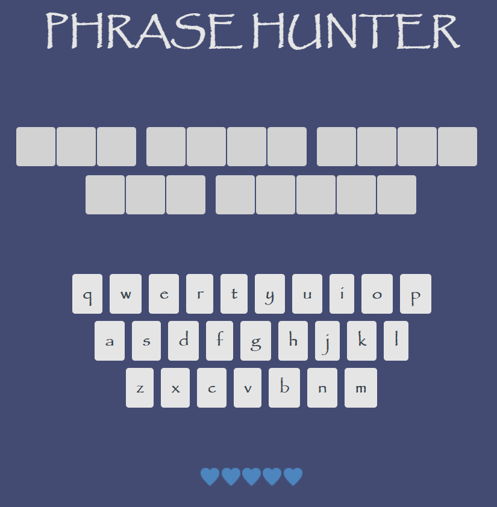
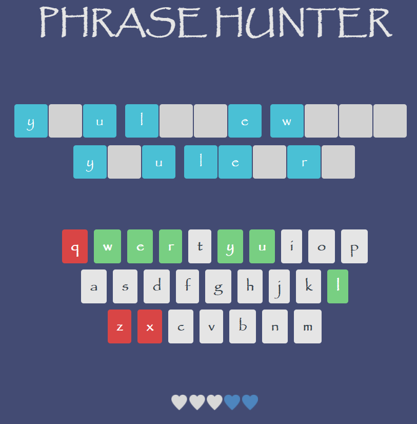

# Phrase Hunter

A JavaScript phrase-guessing game similar to hangman or Wheel of Fortune.

A live demo can be found [here](https://jimjitsuesq.github.io/portfolio-phrase-hunter/).

## Table of Contents

* [General Info](#general-information)
* [Technologies Used](#technologies-used)
* [Features](#features)
* [Screenshots](#screenshots)
* [Contact](#contact)

## General Information

- This was the fourth project in my Team Treehouse Full-Stack JavaScript Tech Degree.
- I received a grade of "Exceeds Expectations" (the highest available).
- The main focuses of this project included learning more complicated JavaScript functions, advanced object-oriented programming and using JavaScript class syntax.

## Technologies Used

- JavaScript
- HTML
- CSS

## Features

- Real-time validation

## Screenshots

## Contact

Created by [@jimjitsuesq](https://www.jimpeters.dev/).  Feel free to contact me!
